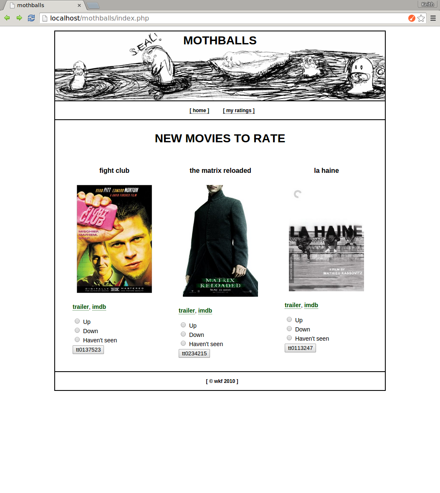

This is a webapp I started working on with some friends after we had trouble deciding on a movie to watch together. mothballs would be an online system for intelligent movie recommendations based on our previous likes and dislikes. It never really made it to fruition, but I learned a lot about running a LAMP stack locally.

